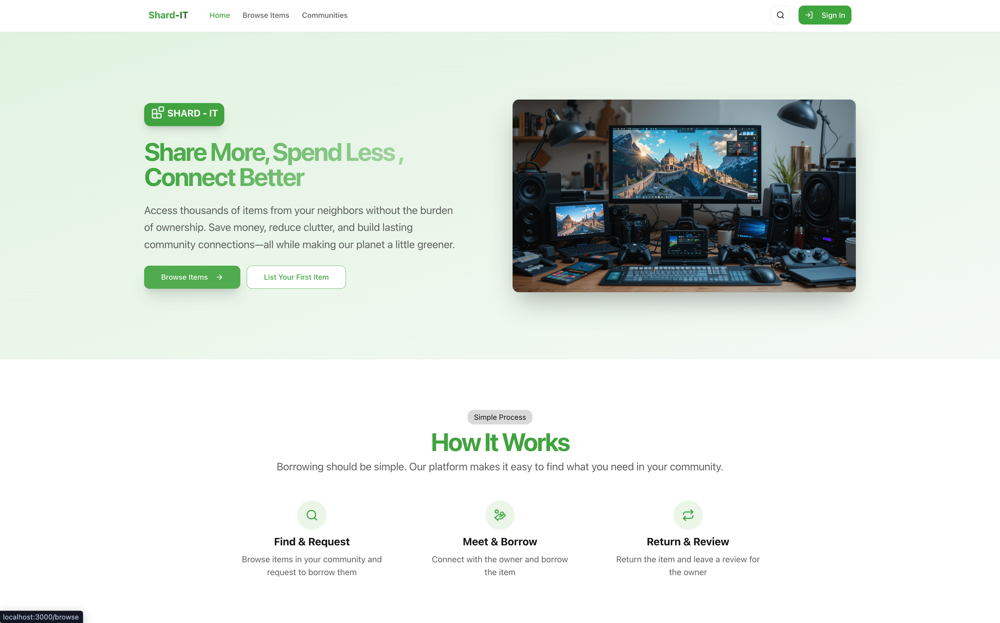

# 📦 Borrow Bundle

> A modern peer-to-peer platform connecting borrowers and lenders in your community


[](https://semver.org)
[](LICENSE.md)

## 🌟 Overview

Borrow Bundle revolutionizes how we access items we need only occasionally. Why buy when you can borrow? Our platform connects neighbors and community members to share resources efficiently, save money, and reduce environmental impact.

## 📋 Table of Contents

- [Features](#-features)
- [App Journey](#-app-journey)
- [Technical Stack](#-technical-stack)
- [Getting Started](#-getting-started)
- [Contributing](#-contributing)
- [License](#-license)

## ✨ Features

- **👤 Smart User Profiles** - Build reputation through lending and borrowing
- **🔍 Intuitive Item Discovery** - Find what you need through categories, search, or location
- **📅 Availability Calendar** - See when items are free to borrow
- **💬 Integrated Messaging** - Coordinate seamlessly with lenders and borrowers
- **⭐ Rating System** - Maintain community trust and quality
- **📱 Cross-platform Experience** - Available on iOS, Android and web

## 🚶 App Journey

### 🔐 Authentication & Onboarding

A smooth entry into the Borrow Bundle community.

<!-- <div align="center">
  
  <p><em>Quick sign-up options with email or social accounts</em></p>

  
  <p><em>Simple registration process with intuitive form fields</em></p>
</div> -->

### 🏠 Home Experience

Your personalized hub for discovering items around you.

<div align="center">
  
  <p><em>Clean interface showcasing trending items and personalized recommendations</em></p>
</div>

### 🔍 Discovering Items

Multiple paths to find exactly what you need.

<div align="center">
  
  
  <p><em>Browse by categories or search with smart filters to narrow down options</em></p>
</div>

### 📋 Item Details

Comprehensive information to make borrowing decisions.

<div align="center">
  
  <p><em>Detailed view with high-quality images, specifications, and availability calendar</em></p>
</div>

### 🤝 Borrowing Flow

A streamlined process from request to return.

<div align="center">
  
  
  
  <p><em>Three simple steps: request, confirm, and coordinate pickup</em></p>
</div>

### 📤 Lending Items

Share your items with the community effortlessly.

<div align="center">
  
  <!-- 
  <p><em>Intuitive listing creation and management dashboard</em></p> -->
</div>

### 👤 User Profile

Your Borrow Bundle identity and history.

<div align="center">
  
  <!-- 
  <p><em>Professional profile showcasing reputation and transaction history</em></p> -->
</div>

<!-- ### 💬 Messaging System

Seamless communication between community members.

<div align="center">
  
  
  <p><em>Modern chat interface with real-time messaging capabilities</em></p>
</div> -->

## 🔧 Technical Stack

Borrow Bundle leverages cutting-edge technologies:

| Layer | Technologies |
|-------|-------------|
| **Frontend** | React Native, Redux, Styled Components |
| **Backend** | Node.js, Express, GraphQL |
| **Database** | MongoDB with Mongoose |
| **Authentication** | JWT, OAuth 2.0 |
| **Real-time** | Socket.io |
| **Location** | Google Maps API |
| **Payments** | Stripe |
| **CI/CD** | GitHub Actions |

## 🚀 Getting Started

### Prerequisites

- Node.js v14+
- npm or yarn
- MongoDB

### Installation

```bash
# Clone the repository
git clone https://github.com/yourusername/borrow-bundle.git

# Navigate to project directory
cd borrow-bundle

# Install dependencies
npm install

# Configure environment
cp .env.example .env
# Edit .env with your configuration

# Start development server
npm start
```

### Development Workflow

1. Create a feature branch: `git checkout -b feature/amazing-feature`
2. Make your changes
3. Commit: `git commit -m 'Add amazing feature'`
4. Push: `git push origin feature/amazing-feature`
5. Open a Pull Request

## 👥 Contributing

We love contributions from our community! See our [CONTRIBUTING.md](CONTRIBUTING.md) for guidelines.

## 📄 License

This project is licensed under the MIT License - see [LICENSE.md](LICENSE.md) for details.

---

<div align="center">
  <p>Made with ❤️ by the Borrow Bundle Team</p>
</div>
